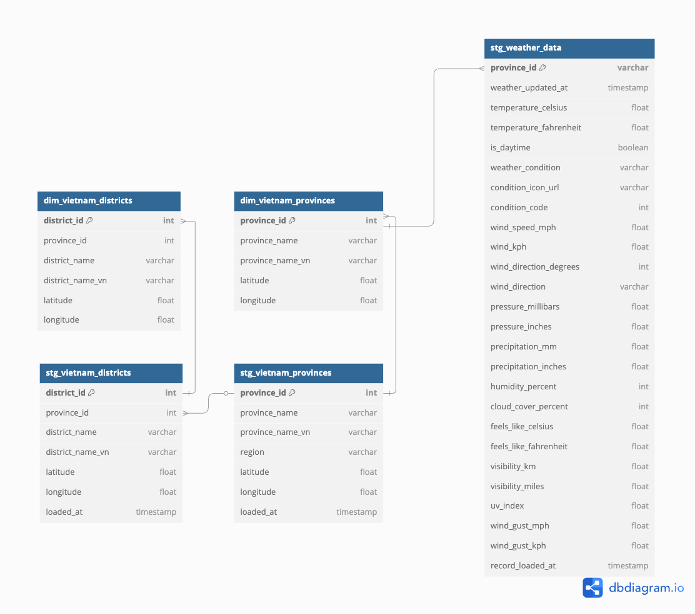

# Weather ML Project

## Overview
This project is a complete machine learning and analytics pipeline for weather data in Vietnam. It integrates real-time data ingestion, batch processing, data transformation, analytics, and prediction. The stack includes Apache Airflow for orchestration, Apache Kafka for streaming, dbt for data modeling, and supports ML model training and deployment.

## 🌐 Data Sources

Weather API: WeatherAPI

Frequency: Hourly ingestion

Coverage: All 63 provinces in Vietnam

---

## Features

- **Data Pipeline Orchestration**: Automated workflows using Apache Airflow
- **Real-time Data Streaming**: Kafka producers and consumers for ingesting weather data from APIs
- **Data Transformation & Modeling**: dbt models for staging, intermediate, marts, and prediction layers
- **Machine Learning**: Model training, evaluation, and prediction for weather forecasting
- **Incremental & Historical Processing**: Efficient, scalable data handling with dbt incremental models
- **Data Quality & Testing**: dbt tests for data integrity and relationships
- **AI Chatbot**: Natural language interface for weather data queries and document processing
- **Containerized Architecture**: Docker-based deployment for all components
- **Cloud & Local Storage**: Support for large model files via external storage (not tracked in git)
- **Documentation & Monitoring**: dbt docs, Airflow UI, and logging

---

## Project Structure

```
├── airflow/                   # Airflow DAGs and configurations
│   └── dags/                  # Custom DAGs for ETL and dbt runs
├── dbt/                       # dbt project for data transformation
│   ├── models/
│   │   ├── 01_staging/        # Staging models (raw to clean)
│   │   ├── 02_int/            # Intermediate models (feature engineering)
│   │   ├── 03_marts/          # Fact and dimension models (analytics) & Prediction models (ML outputs)
│   │
│   ├── macros/                # Custom dbt macros
│   ├── tests/                 # Custom dbt tests
│   ├── seeds/                 # Static reference data
│   └── docs/                  # dbt documentation
├── kafka/                     # Kafka producers and consumers
│   ├── producers/             # Weather API producer
│   └── consumers/             # Data consumer for ingestion
├── AI_chatbot/               # AI chatbot with weather data integration
│   ├── streamlit_app_2.py    # Enhanced weather-specific chatbot
│   └── pdf_ingest.py         # PDF processing and vector storage
├── training_weather_model/    # ML model training scripts and (externally stored) model files
├── configs/                   # Configuration files for all services
├── data/                      # Local data storage (excluded from git)
├── scripts/                   # Utility and helper scripts
├── .gitignore                 # Git ignore rules (including large files)
├── .gitattributes             # Git LFS and attribute settings
└── README.md                  # Project documentation
```

---

## Data Flow

### 🔄 Real-time Pipeline
1. **Data Ingestion**:
   - **Kafka Producer**: Fetches weather data from WeatherAPI for all 63 Vietnamese provinces
   - **Kafka Consumer**: Streams data into Snowflake raw tables
   - **Frequency**: Hourly data collection

2. **Data Processing**:
   - **Staging Layer**: Raw data cleaning and type casting (`stg_weather_data`)
   - **Intermediate Layer**: Feature engineering and aggregations (`int_weather_province`)
   - **Marts Layer**: Analytics-ready fact and dimension tables

3. **ML Pipeline**:
   - **Training**: Historical data feeds ML models for weather prediction
   - **Prediction**: Models generate 7-day forecasts for temperature, precipitation, humidity, wind, and conditions
   - **Storage**: Predictions stored in `predict_weather_province_7days` table

4. **Orchestration**:
   - **Airflow DAGs**: Schedule and monitor entire pipeline
   - **dbt Runs**: Transform and load data incrementally
   - **Quality Checks**: Automated testing and validation

### 📊 Data Architecture
- **Raw Layer**: Kafka → Snowflake raw tables
- **Staging Layer**: `stg_weather_data`, `stg_vietnam_provinces`, `stg_vietnam_districts`
- **Intermediate Layer**: `int_weather_province`, `int_current_weather_province`
- **Marts Layer**:
  - **Facts**: `fct_weather_province`, `fct_weather_region`, `fct_current_weather_province`
  - **Dimensions**: `dim_vietnam_provinces`, `dim_vietnam_districts`
  - **Predictions**: `predict_weather_province_7days`

---

---

## ERD



- For the editable schema, see the [DBML file](docs/weather_ml_erd.dbml) (compatible with [dbdiagram.io](https://dbdiagram.io)).

---


## 🤖 ML Models

### Overview

This project uses a **multi-output machine learning approach** for short-term weather forecasting:

- **Model Types**:
  - `MultiOutputRegressor` (Random Forest) → for continuous weather metrics
  - `RandomForestClassifier` → for categorical `condition` prediction
- **Targets**:
  - **Temperature**: `avgtemp_c`, `maxtemp_c`, `mintemp_c`
  - **Precipitation**: `totalprecip_mm`, `daily_will_it_rain`, `daily_chance_of_rain`
  - **Humidity**: `avghumidity`
  - **Wind**: `maxwind_kph`, `maxwind_mph`
  - **Condition**: `condition` (weather description)
- **Features**: Lag features from the previous 3 days
- **Forecast Horizon**: 2-day prediction window

---

### 🔁 Build & Deploy Pipeline

1. **Train Locally**
   Train the model in local using historical weather data export from snowflake

2. **Upload to Snowflake Stage**

3. **Create UDF / Stored Procedure**

4. **Use in DBT Model**

---

## 🤖 AI Chatbot

### Overview

The Weather ML project includes an intelligent AI chatbot system that provides natural language interaction with weather data and project documentation. The chatbot leverages multiple AI models and integrates with the data pipeline for real-time weather information.

### 🚀 Features

#### **Multi-Model Support**
- **OpenAI Models**: GPT-3.5-turbo, GPT-4
- **Model Switching**: Real-time model selection during conversations

#### **Weather Data Integration**
- **Current Weather Queries**: Real-time weather data from Snowflake
- **Historical Weather**: Past weather data with date parsing
- **Weather Predictions**: 7-day forecast data from ML models
- **Location Intelligence**: Automatic province/city extraction from queries

#### **Document Processing (RAG)**
- **PDF Upload**: Upload and process project documentation
- **Vector Storage**: Pinecone integration for semantic search
- **Context-Aware Responses**: RAG-powered answers from uploaded documents
- **Source Attribution**: Automatic source file references in responses

#### **Conversation Management**
- **Multi-Conversation Support**: Switch between different chat sessions
- **Memory Persistence**: Conversation history maintained across sessions
- **Customizable Prompts**: System prompt customization for different use cases

### 🛠️ Technical Architecture

#### **Core Components**
```
AI_chatbot/
├── streamlit_app_2.py        # Enhanced weather-specific chatbot
├── pdf_ingest.py             # PDF processing and vector storage
```

#### **AI Tools & Capabilities**
- **@tool search_similar_chunks()**: RAG-based document search
- **@tool query_current_weather()**: Real-time weather data queries
- **@tool query_past_weather()**: Historical weather data with date parsing
- **@tool query_predict_weather()**: ML prediction data access

#### **Data Sources**
- **Snowflake Integration**: Direct database queries for weather data
- **Pinecone Vector DB**: Semantic search for document retrieval
- **OpenAI Embeddings**: Text vectorization for RAG
- **LangChain/LangGraph**: Conversation flow management

### 📱 User Interface

#### **Streamlit Web App**
- **Real-time Chat**: Interactive conversation interface
- **File Upload**: PDF document processing
- **Model Selection**: Dropdown for AI model switching
- **Conversation Management**: Sidebar for session control
- **Debug Information**: Optional technical details display


### 🎯 Use Cases

#### **Weather Data Queries**
- Current weather conditions for any Vietnamese province
- Historical weather data with natural date parsing
- Weather predictions and forecasts
- Comparative weather analysis


---

## ERD


- For the editable schema, see the [DBML file](docs/weather_ml_erd.dbml) (compatible with [dbdiagram.io](https://dbdiagram.io)).

---


**Key relationships:**
- Weather data is linked to provinces (and optionally districts) via surrogate keys from dimension tables.
- All relationships are enforced using foreign keys in the DBML and reflected in the ERD.

This approach ensures data integrity, scalability, and clear lineage from raw sources to analytics-ready tables.
---

## Data Quality & Testing

- **dbt tests**: Not null, unique, relationships, accepted ranges
- **Airflow monitoring**: Task success/failure, logs
- **Model validation**: ML metrics and evaluation scripts

---

## Documentation

- **dbt docs**:
  Build and serve with
  `dbt docs generate && dbt docs serve --port 8081`
- **Airflow UI**:
  Monitor DAGs and tasks at `http://localhost:8080`

---

## Maintenance

- **Incremental loads**: dbt incremental models for efficient updates
- **Full refresh**:
  `dbt run --full-refresh`
- **Model retraining**: Update ML models as needed

---
