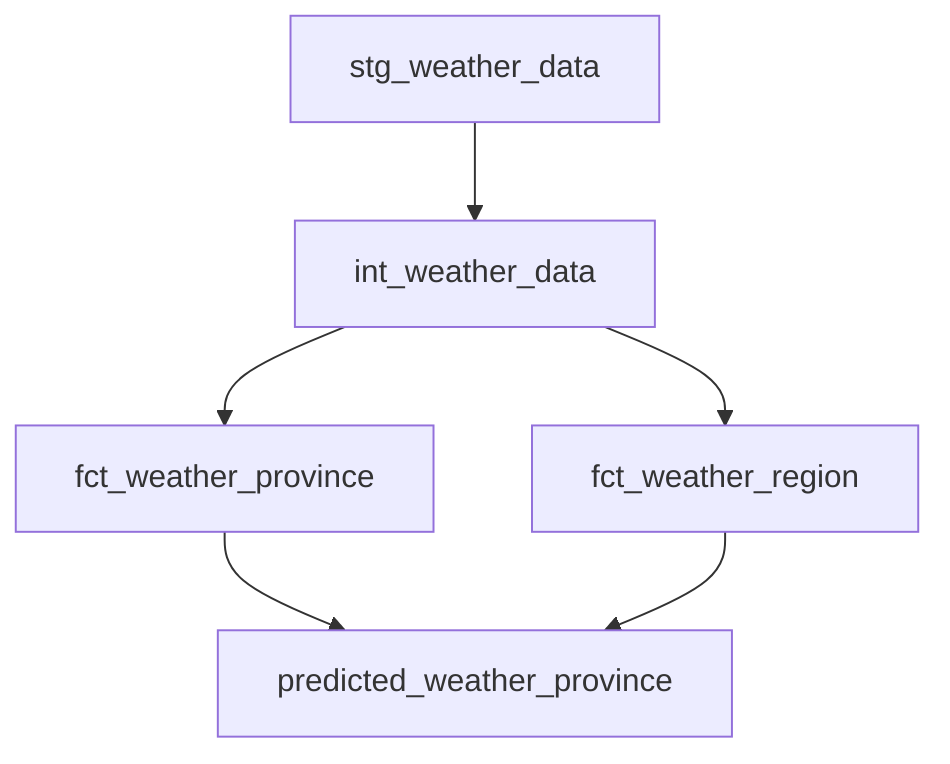

# Weather ML Project

## Overview
This project is a complete machine learning and analytics pipeline for weather data in Vietnam. It integrates real-time data ingestion, batch processing, data transformation, analytics, and prediction. The stack includes Apache Airflow for orchestration, Apache Kafka for streaming, dbt for data modeling, and supports ML model training and deployment.

## 🌐 Data Sources

Weather API: WeatherAPI

Frequency: Hourly ingestion

Coverage: All 63 provinces in Vietnam

---

## Features

- **Data Pipeline Orchestration**: Automated workflows using Apache Airflow
- **Real-time Data Streaming**: Kafka producers and consumers for ingesting weather data from APIs
- **Data Transformation & Modeling**: dbt models for staging, intermediate, marts, and prediction layers
- **Machine Learning**: Model training, evaluation, and prediction for weather forecasting
- **Incremental & Historical Processing**: Efficient, scalable data handling with dbt incremental models
- **Data Quality & Testing**: dbt tests for data integrity and relationships
- **Containerized Architecture**: Docker-based deployment for all components
- **Cloud & Local Storage**: Support for large model files via external storage (not tracked in git)
- **Documentation & Monitoring**: dbt docs, Airflow UI, and logging

---

## Project Structure

```
├── airflow/                   # Airflow DAGs and configurations
│   └── dags/                  # Custom DAGs for ETL and dbt runs
├── dbt/                       # dbt project for data transformation
│   ├── models/
│   │   ├── 01_staging/        # Staging models (raw to clean)
│   │   ├── 02_int/            # Intermediate models (feature engineering)
│   │   ├── 03_marts/          # Fact and dimension models (analytics) & Prediction models (ML outputs)
│   │
│   ├── macros/                # Custom dbt macros
│   ├── tests/                 # Custom dbt tests
│   ├── seeds/                 # Static reference data
│   └── docs/                  # dbt documentation
├── kafka/                     # Kafka producers and consumers
│   ├── producer.py            # Weather API producer
│   └── consumer.py            # Data consumer for ingestion
├── training_weather_model/    # ML model training scripts and (externally stored) model files
├── configs/                   # Configuration files for all services
├── data/                      # Local data storage (excluded from git)
├── scripts/                   # Utility and helper scripts
├── .gitignore                 # Git ignore rules (including large files)
├── .gitattributes             # Git LFS and attribute settings
└── README.md                  # Project documentation
```

---

## Data Flow

1. **Ingestion**:
   - Kafka producer fetches weather data from APIs and streams to Kafka topics.
   - Kafka consumer ingests data into the raw database.

2. **Staging (dbt)**:
   - Raw weather data is cleaned and typed in `stg_weather_data`.
   - Province and district reference data staged.

3. **Intermediate (dbt)**:
   - Feature engineering and aggregation in `int_weather_province`

4. **Marts (dbt)**:
   - Fact tables: `fct_weather_province`, `fct_weather_region`
   - Dimension tables: `dim_vietnam_provinces`, `dim_vietnam_districts`

5. **Prediction (dbt/ML)**:
   - ML models trained on historical data.
   - Predictions written to `predict_weather_province` and similar tables.

6. **Orchestration (Airflow)**:
   - DAGs schedule and monitor the entire pipeline, including dbt runs and ML tasks.

---


## ML Models

Model Type: Multi-output Random Forest Regressor + Classification for condition

Targets:

Temperature: avgtemp_c, maxtemp_c, mintemp_c

Precipitation: totalprecip_mm, daily_will_it_rain, daily_chance_of_rain

Humidity: avghumidity

Wind: maxwind_kph, maxwind_mph

Condition: condition (classification)

Features: Lag values from the last 3 days

Forecast Horizon: 3-day prediction

## ERD


- For the editable schema, see the [DBML file](docs/erd.dbml) (compatible with [dbdiagram.io](https://dbdiagram.io)).

---



## Data Modeling Approach

Our data model follows a modern data warehouse architecture using dbt and Snowflake. The approach is:

- **Staging tables (`stg_*`)**: Raw data is cleaned and typed, preserving source granularity.
- **Dimension tables (`dim_*`)**: Provide descriptive, slowly changing attributes for provinces and districts, enabling consistent joins and reporting.
- **Fact tables (`fct_*`)**: Store event-level or aggregated weather measurements, optimized for analytics and reporting.
- **Intermediate models (`int_*`)**: Used for business logic and aggregations before populating fact tables.

**Key relationships:**
- Each province can have multiple districts.
- Weather data is linked to provinces (and optionally districts) via surrogate keys from dimension tables.
- All relationships are enforced using foreign keys in the DBML and reflected in the ERD.

This approach ensures data integrity, scalability, and clear lineage from raw sources to analytics-ready tables.
---

## Data Quality & Testing

- **dbt tests**: Not null, unique, relationships, accepted ranges
- **Airflow monitoring**: Task success/failure, logs
- **Model validation**: ML metrics and evaluation scripts

---

## Documentation

- **dbt docs**:
  Build and serve with
  `dbt docs generate && dbt docs serve --port 8081`
- **Airflow UI**:
  Monitor DAGs and tasks at `http://localhost:8080`

---

## Maintenance

- **Incremental loads**: dbt incremental models for efficient updates
- **Full refresh**:
  `dbt run --full-refresh`
- **Model retraining**: Update ML models as needed

---
